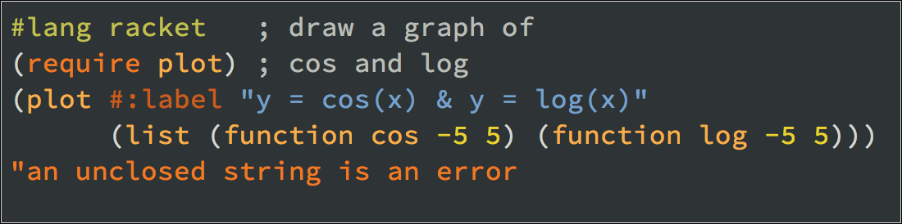

drracket-dark-tango
===================

This package adds a Dark Tango colorscheme to DrRacket, the IDE
of the [Racket programming language](http://www.racket-lang.org).

The colorscheme is based on the color palette developed for the [Tango Desktop Project](http://tango.freedesktop.org/Tango_Icon_Theme_Guidelines).

Note: Color schemes are supported by [Racket](http://www.racket-lang.org) versions 6.0 and newer.

Installation
------------

From the package catalog:

  * `raco pkg install drracket-dark-tango`

  Directly from github:

    * `raco pkg install git://github.com/dmcbane/drracket-dark-tango`

    License
    -------

    Distributed under the MIT license. See the LICENSE.txt file.
